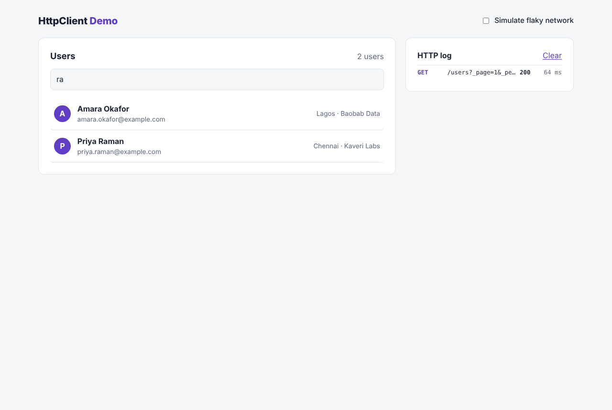
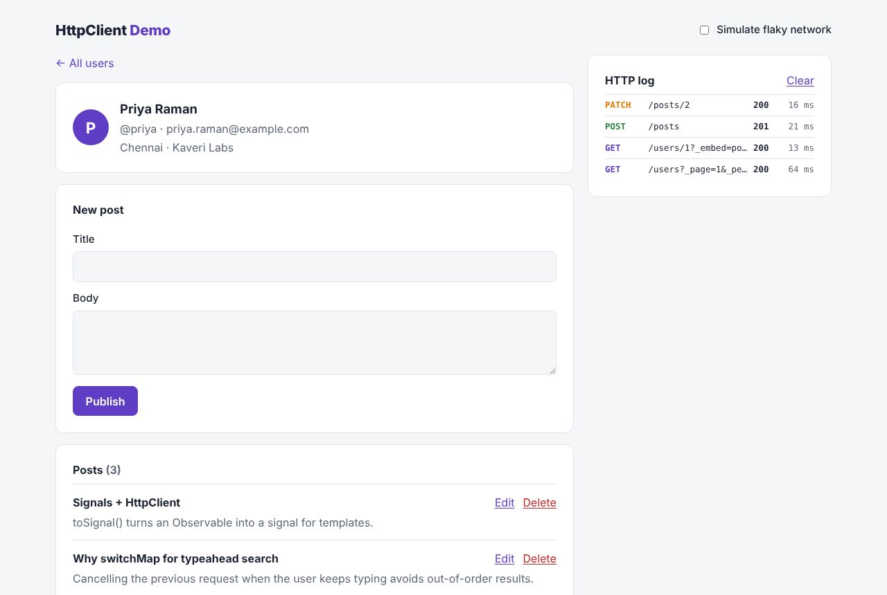
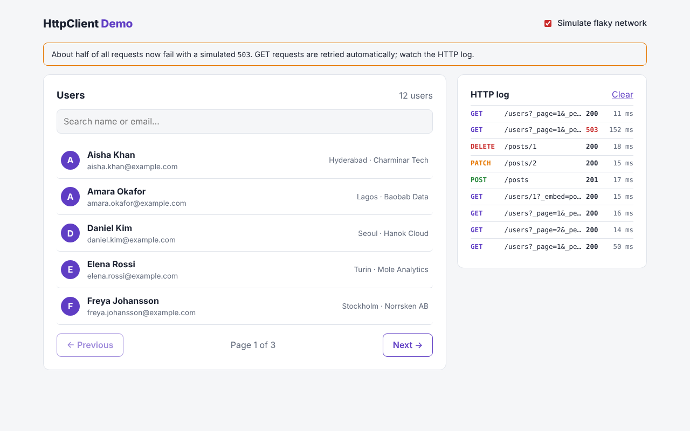

# HttpClient Demo

[](https://github.com/imkarthiknr/httpclient-demo/actions/workflows/ci.yml)


A hands-on reference for **Angular's `HttpClient`**: typed requests, search and pagination, every REST verb, functional interceptors, retries with backoff, optimistic updates and testing. It's all wired to a local **json-server** mock API, so it runs offline in one command.

A live **HTTP log** panel shows every request the app makes, and a **"Simulate flaky network"** switch makes about half of all requests fail, so you can watch retries and error handling happen.

This was my first Angular `HttpClient` experiment in 2020. In 2026 I rebuilt it as a documented, tested reference app. [CHANGELOG.md](CHANGELOG.md) has the history.

| User directory (search + pagination)  | User detail (POST / PATCH / DELETE)        | Flaky network (retries in the log)             |
| ------------------------------------- | ------------------------------------------ | ---------------------------------------------- |
|   |  |  |

## Quick start

You need Node.js **22.12+** or **24+**.

```bash
git clone https://github.com/imkarthiknr/httpclient-demo.git
cd httpclient-demo
npm install
npm start          # mock API on :3000 + app on :4200
```

Open <http://localhost:4200>.

## What it demonstrates

| Pattern                                   | Where                                                                 |
| ----------------------------------------- | --------------------------------------------------------------------- |
| Typed responses: `get<Page<User>>()`      | [`users.service.ts`](src/app/core/services/users.service.ts)          |
| Building queries with immutable `HttpParams` (paging, sorting, a JSON `_where` filter) | [`users.service.ts`](src/app/core/services/users.service.ts) |
| Configurable base URL via an `InjectionToken` | [`api-config.ts`](src/app/core/api-config.ts)                     |
| `POST`, `PATCH` (partial update), `DELETE` | [`posts.service.ts`](src/app/core/services/posts.service.ts)        |
| Type-ahead search: `debounceTime` → `switchMap` cancels stale requests | [`user-list.component.ts`](src/app/features/users/user-list/user-list.component.ts) |
| URL as state (`/users?q=ra&page=2`) for shareable, back-button-friendly views | [`user-list.component.ts`](src/app/features/users/user-list/user-list.component.ts) |
| Related data in one round trip (`?_embed=posts`) | [`users.service.ts`](src/app/core/services/users.service.ts)   |
| Optimistic delete with rollback on failure | [`user-detail.component.ts`](src/app/features/users/user-detail/user-detail.component.ts) |
| **Functional interceptors** and their ordering | [`app.config.ts`](src/app/app.config.ts)                         |
| Retry with exponential backoff (GET only; network and 5xx errors only) | [`retry.interceptor.ts`](src/app/core/http/retry.interceptor.ts) |
| Per-request opt-out with `HttpContextToken` | [`context-tokens.ts`](src/app/core/http/context-tokens.ts)         |
| Request logging, timing and a global loading bar | [`activity.interceptor.ts`](src/app/core/http/activity.interceptor.ts) |
| Fault injection for demos and tests       | [`chaos.ts`](src/app/core/http/chaos.ts)                              |
| User-friendly error messages              | [`http-error.ts`](src/app/core/http/http-error.ts)                    |
| Unit testing with `HttpTestingController` and fake timers | [`interceptors.spec.ts`](src/app/core/http/interceptors.spec.ts) |
| End-to-end tests against the real mock API | [`e2e/users.spec.ts`](e2e/users.spec.ts)                            |

### Interceptor chain

```
component → HttpClient → retryInterceptor → activityInterceptor → chaosInterceptor → json-server
                          (re-subscribes     (logs every attempt,  (optionally fails
                           on 0/5xx GETs)     tracks in-flight)     with a 503)
```

The order is deliberate. Because `activity` sits inside `retry`, each retry attempt gets its own row in the HTTP log. Because `chaos` is innermost, each attempt is an independent roll of the dice.

## Tech stack

- **Angular 21**: standalone components, signals, zoneless change detection, lazy routes, `withComponentInputBinding`, `withFetch`
- **RxJS 7**
- **json-server 1.0 (beta)**: REST mock API from [`mock-api/seed.json`](mock-api/seed.json)
- **Vitest** (unit tests, 36 tests) and **Playwright** (end-to-end tests, 5 tests)
- **Prettier** and **GitHub Actions**

## Project structure

```
httpclient-demo/
├── src/app/
│   ├── core/
│   │   ├── api-config.ts              API_BASE_URL token
│   │   ├── models/api.model.ts        User, Post, Page<T>
│   │   ├── services/                  UsersService, PostsService
│   │   └── http/                      Interceptors, activity log, error mapping, context tokens
│   ├── features/users/
│   │   ├── user-list/                 Search + pagination
│   │   └── user-detail/               Profile + posts CRUD
│   ├── shared/components/http-log/    Live request log panel
│   ├── app.config.ts                  Providers + interceptor order
│   └── app.routes.ts
├── mock-api/
│   ├── seed.json                      12 users, 12 posts (committed)
│   └── serve.mjs                      Runs json-server on a working copy
├── e2e/                               Playwright specs
├── proxy.conf.json                    /api → http://localhost:3000
└── playwright.config.ts
```

## Scripts

| Command             | What it does                                            |
| ------------------- | ------------------------------------------------------- |
| `npm start`         | Mock API and Angular dev server together                |
| `npm run api`       | Mock API only (keeps data between runs)                 |
| `npm run api:reset` | Mock API with a fresh copy of the seed data             |
| `npm run start:web` | Angular dev server only                                 |
| `npm test`          | Unit tests (Vitest)                                     |
| `npm run e2e`       | End-to-end tests (starts the API and app automatically) |
| `npm run build`     | Production build to `dist/`                             |
| `npm run format`    | Format with Prettier                                    |

Setup, architecture notes, testing tips and troubleshooting are in [DEVELOPMENT.md](DEVELOPMENT.md).

## License

[MIT](LICENSE) © Karthik N R
